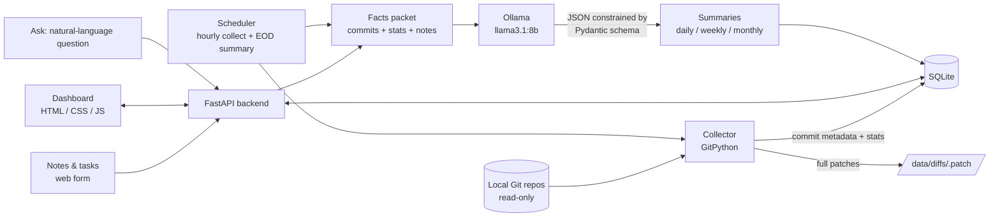
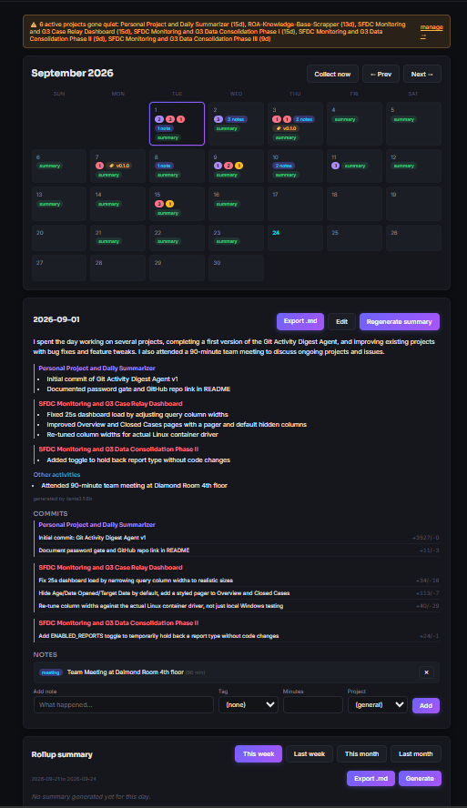

# Daybook

**A local-first work journal: it reads your Git commits, takes your notes and tasks, and has a local LLM write your daily, weekly and monthly engineering summaries.**


## Why this exists

At the end of a week I could rarely say what I had actually done: the commits were in Git, the meetings and demos were nowhere, and writing a status update meant reconstructing it from memory. Daybook does that reconstruction for me. It collects commits from my local repos, lets me jot down notes and tasks, and turns both into a readable summary grouped by project.

It is also deliberately **local-first and private by design**. Commit data, notes, summaries and the LLM all stay on my machine: the summaries come from a model served by Ollama on localhost, with no cloud LLM API and no GitHub API. (One caveat: the dashboard pages load two web fonts from Google Fonts in the browser. See [What I'd do next](#what-id-do-next).)

## Architecture



Collection and summarization are kept separate. Collection is cheap and involves no LLM, so it can run often. Summarization is triggered on demand from the dashboard, or by an optional end-of-day job, and only ever sends a compact "facts packet" (commit messages, stats and notes, not full diffs) to the model.

## Features

- **Commit collection** from any number of local Git repos, read-only, via GitPython. Stores hash, author/committer, timestamps, message, branch, parents, tags and file/insertion/deletion stats in SQLite. Full patches go to flat files under `data/diffs/`, with lockfiles, `node_modules`, build output and similar noise skipped ([config/diff_exclusions.yaml](config/diff_exclusions.yaml)).
- **Incremental collection**: commits already in the database are skipped, so repeat runs only do the expensive stats/diff work for new commits (see [Performance](#performance)). Git tags added to old commits later are re-synced cheaply.
- **Notes** (free text, optional duration, tag: meeting / demo / discussion / blocker / idea, optional project) and **tasks** (open/done, optional due date and project), through the web dashboard.
- **LLM summaries** for a day, week or month: a short narrative, project-wise bullets from commits, and "other activities" from notes. Output is constrained by a **Pydantic schema** passed to Ollama's structured-output `format` parameter, then validated on the way back. Summaries are editable and regenerable, and a hand-edited summary is never overwritten by the automatic end-of-day job.
- **Ask about your work**: type a question such as "what did I do last week on the API project?". Date range and project are picked out with deterministic heuristics (not the LLM), the matching facts are retrieved with SQL, and Ollama answers using only that context.
- **Scheduled collection**: an in-app loop (`COLLECT_INTERVAL_SECONDS`) and an optional end-of-day job (`EOD_HOUR`) that collects and generates that day's summary. A Windows Task Scheduler script is included as an alternative.
- **Dashboard**: calendar with a per-day view, a contribution-style activity heatmap, per-project colors, a "quiet project" flag after N days without commits, a "missing summaries" panel with one-click backfill, and Markdown export of any day or rollup.
- **Optional password gate** (HTTP Basic Auth) via `DASHBOARD_PASSWORD`.

## Performance

`collector/git_reader.py` takes a `skip_hashes` set. The collector loads the hashes it already stores for a project and passes them in, so `read_commits()` only lists those commits and skips the per-commit stats and patch computation, which dominates runtime, especially over a Docker bind mount.

I measured a **~24x speedup on repeat runs (16.6 s → 0.7 s across 4 repos)** while building this. That timing was a one-off measurement on my own machine and isn't reproduced by any test in this repo. <!-- TODO: confirm the 24x figure before publishing, or re-measure -->

## Tech stack

| Layer | Choice |
|---|---|
| Language / backend | Python 3.13, FastAPI, Uvicorn |
| Validation & structured LLM output | Pydantic v2 |
| Git access | GitPython (read-only) |
| Storage | SQLite (metadata) + flat patch files on disk |
| LLM | Ollama, default model `llama3.1:8b` (configurable) |
| HTTP client | httpx |
| Frontend | Vanilla HTML / CSS / JS (no build step) |
| Packaging | Docker Compose |

## Quick start

**Prerequisite:** [Ollama](https://ollama.com) running locally with the model pulled: `ollama pull llama3.1:8b`. Collecting commits, notes and tasks works without it, but summaries and the Ask page need it.

### With Docker Compose

```bash
cp .env.example .env
# edit .env: set REPOS_ROOT to the folder containing your git repos
#   (forward slashes on Windows, e.g. C:/Users/you/code)
docker compose up -d --build
```

Open http://127.0.0.1:8510, go to **Projects**, and add a repo by its path on your machine (e.g. `C:/Users/you/code/my-app`). The compose file mounts `REPOS_ROOT` read-only at `/repos` and translates paths under it for the collector. Ollama is reached on the host through `host.docker.internal`.

### Without Docker

```bash
python -m venv .venv
source .venv/bin/activate        # Windows: .venv\Scripts\activate
pip install -r requirements.txt
cp .env.example .env
python -m dashboard.backend.main
```

Open http://127.0.0.1:8510 (the port comes from `DASHBOARD_PORT`). The database is created on first start. Add projects on the **Projects** page, then click **Collect now** on the Calendar page.

## Configuration

All settings are environment variables (see [.env.example](.env.example)):

| Variable | Default | Purpose |
|---|---|---|
| `OLLAMA_HOST` | `http://localhost:11434` | Ollama server URL (Compose sets it to `host.docker.internal`) |
| `OLLAMA_MODEL` | `llama3.1:8b` | Model used for all summaries and Ask |
| `DB_PATH` | `./data/activity.db` | SQLite file |
| `DIFF_STORAGE_PATH` | `./data/diffs` | Where patch files are written |
| `DIFF_EXCLUSIONS_PATH` | `./config/diff_exclusions.yaml` | Globs whose diffs aren't stored |
| `DASHBOARD_HOST` / `DASHBOARD_PORT` | `127.0.0.1` / `8510` (via `.env.example`) | Server binding |
| `DASHBOARD_PASSWORD` | *(empty = no auth)* | HTTP Basic Auth password, username ignored |
| `REPOS_ROOT` | `./repos` | Docker only: host folder holding your repos, mounted read-only at `/repos` |
| `TZ` | `UTC` | Docker only: container timezone (matters for `EOD_HOUR`) |
| `COLLECT_INTERVAL_SECONDS` | `0` native, `3600` in Compose | In-app periodic collection, `0` disables |
| `EOD_HOUR` | `-1` | Local hour (0-23) for the automatic end-of-day collect and summary, `-1` disables |
| `QUIET_THRESHOLD_DAYS` | `7` | Days without commits before an active project is flagged quiet |

`scripts/run_collector.ps1` is an optional Windows Task Scheduler entry point for native runs. It is not needed if you use the in-app loop.

## Project structure

```
daybook/
├── collector/          # GitPython reader, patch writer, host→container path mapping, collect entrypoint
├── summarizer/         # facts packet, Ollama client, daily/rollup generation, Ask, backfill
├── dashboard/
│   ├── backend/        # FastAPI app, auth middleware, routes (projects, notes, tasks, days,
│   │                   #   summaries, rollups, chat, export, backfill, overview, sync)
│   └── frontend/       # static HTML pages + vanilla JS/CSS
├── db/                 # schema.sql and connection helper (schema applied on startup)
├── config/             # diff_exclusions.yaml
├── scripts/            # run_collector.ps1 (Windows Task Scheduler wrapper)
├── docs/screenshots/   # README images
├── Dockerfile
├── docker-compose.yml
├── requirements.txt    # pinned versions
└── .env.example
```

## Screenshots

<!-- TODO: add images before publishing. Screens to capture, using fake/demo repos and notes only (no employer names): -->
<!-- 1. docs/screenshots/dashboard.png — the Dashboard page (activity heatmap + project cards) -->
<!-- 2. docs/screenshots/summary.png — the Calendar page on a day with a generated summary (narrative, project bullets, other activities) -->




## How I built this

I built Daybook with Claude Code as my main development tool, using it for planning and scaffolding, while I drove the design decisions (local-first, collection kept separate from summarization, the schema, which data the LLM gets to see) and verified the behavior by running it against my own real repositories. The repo doesn't currently include an automated test suite.

## What I'd do next

- Add automated tests, starting with the date-range parsing behind Ask, the path translation and the summary parsing.
- Self-host the two Google Fonts so the dashboard makes no external requests at all.
- Full-text search across commits, notes and summaries.
- Add a benchmark script so the incremental-collection speedup can be reproduced.
- Streak tracking and flagging unusually large commits.

## Author

**Shubham Jamdar** · [LinkedIn](https://www.linkedin.com/in/shubham-jamdar-2571271b3) · [GitHub](https://github.com/Shubham261299)

Released under the [MIT License](LICENSE).
